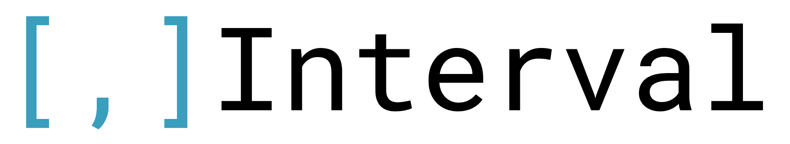

# 

[](https://github.com/tbug/elixir_interval/actions/workflows/ci.yml)
[](https://hex.pm/packages/interval)
[](https://hexdocs.pm/interval/)

Datatype and operations for both discrete and continuous intervals,
Inspired by [PostgreSQL's range types](https://www.postgresql.org/docs/current/rangetypes.html).

Find the documentation at https://hexdocs.pm/interval/


## Installation

The package can be installed by adding `interval` to your list of dependencies in `mix.exs`:

```elixir
def deps do
  [
    {:interval, "~> 1.0.0"}
  ]
end
```

## Built-in Interval Types

- `Interval.IntegerInterval` A discrete interval between two integers.
- `Interval.FloatInterval` A continuous interval between two floats.
- `Interval.DecimalInterval` A continuous interval between two `Decimal` structs.
- `Interval.DateInterval` A discrete interval between two `Date` structs.
- `Interval.DateTimeInterval` A continuous interval between two `DateTime` structs.
- `Interval.NaiveDateTimeInterval` A continuous interval between two `NaiveDateTime` structs.

## Ecto & Postgres `range` types

The builtin types (Like `Interval.DateTimeInterval`) can be used as an `Ecto.Type` out
of the box:

```elixir
# ...
  schema "reservations" do
    field :period, Interval.DateTimeInterval
    # ...
  end
# ...
```

Note though, that this feature only works with `Postgrex`, as the
intervals are converted to a `Postgrex.Range` struct which maps to the correct
range type in the database (like `tstzrange` etc.)

## Defining your own interval type

The library contains a `use` macro that does most of the work for you.

You must implement the `Interval.Behaviour`, which contains a handful of functions.

This is the full definition of the built-in `Interval.Decimal`:

```elixir
defmodule Interval.Decimal do
  use Interval, type: Decimal, discrete: false

  if Interval.Support.EctoType.supported?() do
    use Interval.Support.EctoType, ecto_type: :numrange
  end

  @spec point_valid?(Decimal.t()) :: boolean()
  def point_valid?(a), do: is_struct(a, Decimal)

  @spec point_compare(Decimal.t(), Decimal.t()) :: :lt | :eq | :gt
  def point_compare(a, b) when is_struct(a, Decimal) and is_struct(b, Decimal) do
    Decimal.compare(a, b)
  end

  @spec point_step(Decimal.t(), any()) :: nil
  def point_step(a, _n) when is_struct(a, Decimal), do: nil
end
```

As you can see, defining your own interval types is pretty easy.

## More Examples

### Integer intervals

Integer intervals are discrete intervals (just like the `int4range` in postgres).

```elixir
alias Interval.IntegerInterval
# ...
a = IntegerInterval.new(left: 1, right: 4, bounds: "[]")
b = IntegerInterval.new(left: 2, right: 5, bounds: "[]")

assert IntegerInterval.contains?(a, b)
assert IntegerInterval.overlaps?(a, b)

c = IntegerInterval.intersection(a, b) # [2, 4]
d = IntegerInterval.union(a, b) # [1, 5]
```

Discrete intervals are always normalized to the bound form `[)` (just like in postgres).


### DateTime intervals

DateTime intervals are continuous intervals (just like `tstzrange` in postgrex).

```elixir
alias Interval.DateTimeInterval
# ...
# default bound is  "[)"
y2022 = DateTimeInterval.new(left: ~U[2022-01-01 00:00:00Z], right: ~U[2023-01-01 00:00:00Z])
x = DateTimeInterval.new(left: ~U[2018-07-01 00:00:00Z], right: ~U[2022-03-01 00:00:00Z])

DateTimeInterval.intersection(y2022, x)

# %DateTimeInterval{
#   left: {:inclusive, ~U[2022-01-01 00:00:00Z]},
#   right: {:exclusive, ~U[2022-03-01 00:00:00Z]}
# }
```

